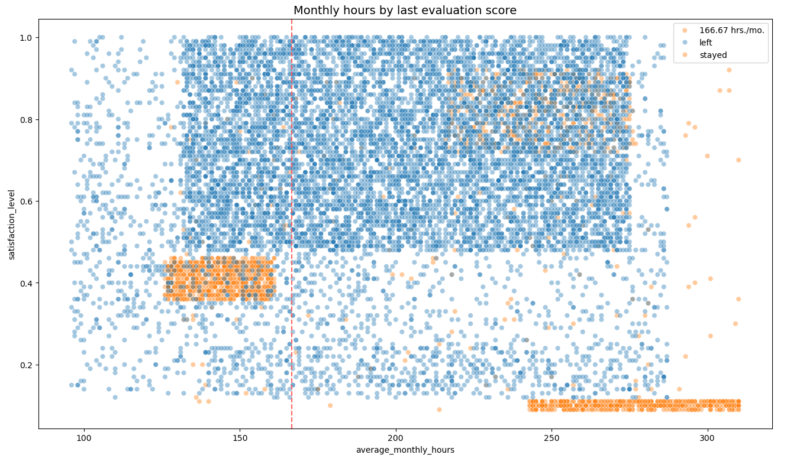
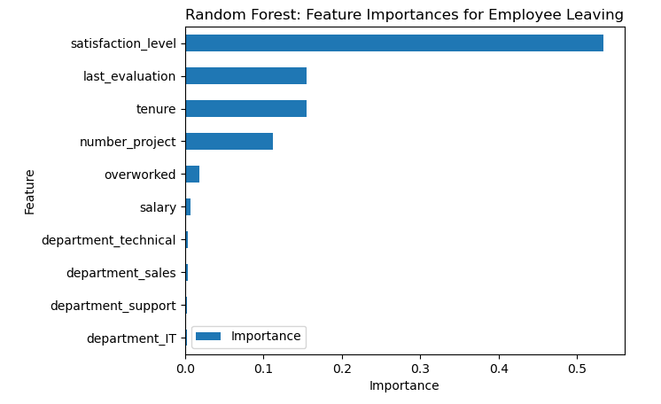

# Employee retention prediction project

## Overview

This project seeks to improve employee retention by analyzing the data collected by the HR department of the company. The purpose of this analysis is to find the key factors driving employee turnover by building a effective model that predicts whether or not an employee will leave the company.

## Process

This section outlines the key steps of this analysis:

### 1. Exploratory Data Analysis (EDA):

Understanding the dataset by summarizing its main characteristics, visualizing distributions, identifying patterns, correlations, and anomalies to gain insights into the data and inform subsequent analysis.

### 2. Data Preprocessing:

Cleaning and transforming raw data into a suitable format for analysis, handling missing values, outliers and inconsistencies.

### 3. Feature Engineering:

Creating new features or transforming existing ones to capture relevant information and improve model performance, selecting the most informative features for modeling.

### 4. Logistic Regression Modeling

Building a statistical model to predict the probability of a binary outcome based on independent variables, using a logistic function to map the linear combination of predictors to a probability between 0 and 1. Evaluating model performance using metrics like accuracy, precision, recall, F1-score, and AUC-ROC.

### 5. Tree-based Modeling:

Creating decision trees or random forests to predict a target variable, handling both numerical and categorical data, and evaluating model performance using metrics like accuracy, precision, recall, and F1-score.

## Dataset

| Variable              | Description                                                       |
| --------------------- | ----------------------------------------------------------------- |
| satisfaction_level    | Employee-reported job satisfaction level [0&ndash;1]              |
| last_evaluation       | Score of employee's last performance review [0&ndash;1]           |
| number_project        | Number of projects employee contributes to                        |
| average_monthly_hours | Average number of hours employee worked per month                 |
| time_spend_company    | How long the employee has been with the company (years)           |
| Work_accident         | Whether or not the employee experienced an accident while at work |
| left                  | Whether or not the employee left the company                      |
| promotion_last_5years | Whether or not the employee was promoted in the last 5 years      |
| Department            | The employee's department                                         |
| salary                | The employee's salary (U.S. dollars)                              |

## Results

*See more technical details  of the results on the [employee retention project summary](Employee_retention_project_summary.pdf) and the [project notebook](predictive_models_for_employee_retention.ipynb)*

The analysis and the feature importances extracted from the models confirms that excessive workload is the primary factor contributing to employee turnover.

Tree-based models, particularly random forest, significantly outperformed logistic regression in predicting employee retention. This model achieved high accuracy and precision, indicating strong predictive power.

According to the analysis, to retain employees, it is suggested to reduce project load especially the number of project that employees can work on, reward employees overtimes and promote employees who have worked for the company for long period of time.

Further analysis could involve removing the `last_evaluation` feature to address potential data leakage concerns and applying clustering techniques like K-means to identify distinct employee groups.

___
___